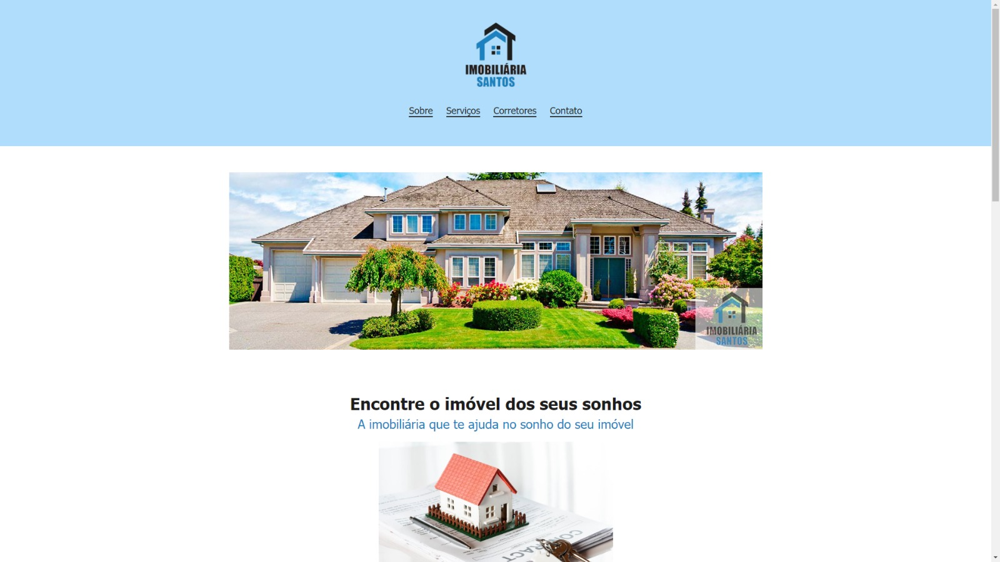

# Página Imobiliária (Devmedia)
Projeto feito com HTML e CSS, faz parte da trilha de front-end da Devmedia.

<h1 align="center">
  Página imobiliária
</h1>

  

Conceitos abordados:

* Tags básicas do HTML
* Meta tags HTML
* Listas no HTML
* Seletores CSS
